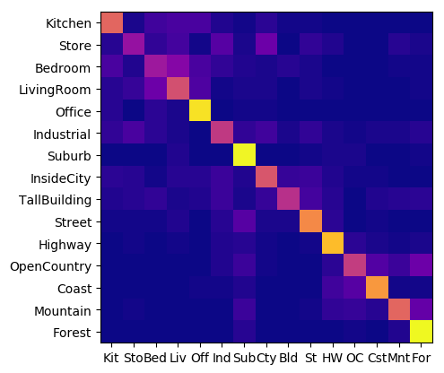

### Scene Recognition with Bag of Words Feature Extraction and Nearest Neighbor/SVM Classifiers
This scene recognition project was a part of Brown University's [Computer Vision course](https://cs.brown.edu/courses/csci1430/proj3/).

My **final results** can be seen [here](http://htmlpreview.github.io/?https://github.com/datmar/scene-recognition/blob/master/results_webpage/index.html)

